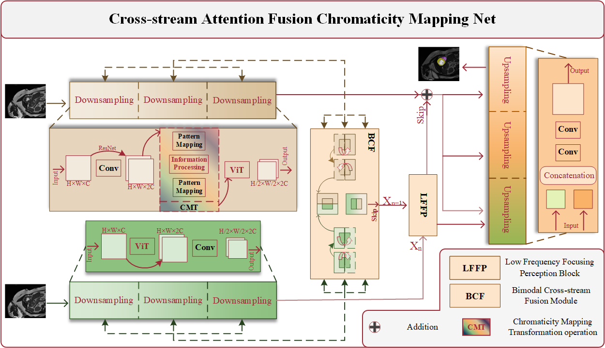
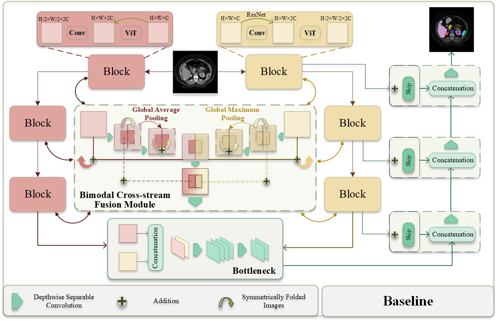
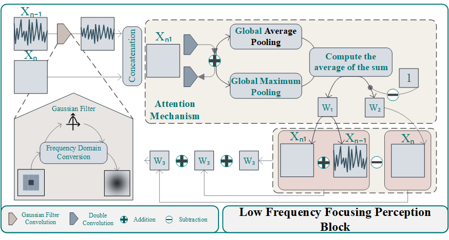
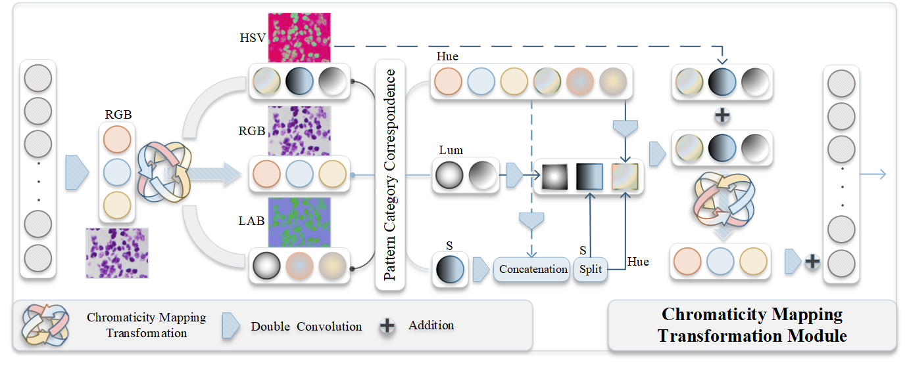

# [IF'2025] A Medical Image Semantic Segmentation Method Based on Multi-Color Space Information Fusion Strategy

Paper Address: https://doi.org/10.1016/j.inffus.2025.103861

***Semantic segmentation technology enables automated analysis of medical images by accurately segmenting lesion areas, driving the development of precision medicine and becoming a key tool in the field of medical imaging. However, its widespread application remains limited by challenges such as differences in medical imaging modalities and insufficient model generalization capability. CFCM Net integrates the feature extraction strengths of Traditional Convolution and ViT through the BCF and employs CMT to achieve mode separation and information differentiation of feature maps. Additionally, the LFFP is designed in the bottleneck to enhance the model's anti-aliasing and noise-resistance capabilities, as well as its focus on deep semantic information.***

## Paper:CFCM Net: A Multi-Class Lesion Semantic Segmentation Method for Medical Images Based on Cross-Modality Flow Fusion

**Authors:Yuefei Wang, RuiXin Cao, Zongyuan Liu, Yongyin Yu, Wenxi Xu, Li Zhang**

### 1. Architecture Overview

***CFCM Net adopts a dual-encoder-single-decoder architecture based on bimodal feature fusion. On the encoding side, the Chromaticity Mapping Transformation (CMT) is used to map and analyze feature maps in different color spaces, enhancing their informational characteristics. At deeper layers, Gaussian filter convolutions are applied to integrate anti-aliasing filtering with an attention mechanism, reducing aliasing at higher semantic levels and ensuring the richness of image information.***

### 2. Our Baseline

***The Baseline utilizes a dual-encoder-single-decoder architecture, which combines misaligned cross-downsampling, ViT, and CNN to facilitate the joint extraction and fusion of global and local features. A key component, the BCF module, is placed at the skip connection to promote effective cross-stream fusion, ensuring that image information is preserved while fully integrating features from both the skip connection and the dual encoders. In the BCF module, the input feature maps from the dual encoders are split along the center line, with symmetric padding added to fill any missing areas. Global average pooling and global max pooling are then applied to compute weights, which are subsequently used to adjust the feature maps. These maps are folded, restored, and concatenated, before being passed to both the original encoding layer and the skip connection for further processing.***

### 3.Module 1:LFFP

***The LFFP module employs Gaussian anti-aliasing filtering to eliminate high-frequency information from the feature map of the last skip connection, retaining low-frequency global information to mitigate the impact of high-frequency noise. Next, a 2×2 convolution kernel is applied to reduce the image dimensions, and the downsized feature map is concatenated with the bottleneck feature map to enhance feature representation. Subsequently, the concatenated feature map undergoes bifurcation and convolutional processing to extract information, with the split features merged through summation to further enrich the information content. Additionally, global average pooling and global max pooling are utilized for weight allocation, assigning distinct weights to different feature maps to optimize feature distribution. Finally, absolute value subtraction, feature fusion via addition, attention mechanisms, and residual connections are applied, enhancing the information richness at the bottleneck while emphasizing global information.***

### 4.Module 2：CMT

***CMT utilizes chromatic mapping transformation to perform mode mapping in the chromatic space on the input feature maps. By fusing the mode features across different chromatic dimensions, it captures deeper information within the feature maps. This mapping transformation amplifies hidden details within the original format, compensating for potential losses of local features during global feature extraction. Furthermore, it enhances the differentiation in information extraction between dual encodings, enabling a deeper and more comprehensive focus on feature information.***

### Datasets:

1. CT Data (LUNG):https://www.kaggle.com/datasets/kmader/finding-lungs-in-ct-data
2. CT Liver (LIVER):https://www.kaggle.com/datasets/zxcv2022/digital-medical-images-for--download-resource
3. Data Science Bowl 2018 (CELL):https://gitcode.com/gh_mirrors/20/2018DSB
4. MICCAI 2015-CVC ClinicDB (POLYP):https://polyp.grand-challenge.org/CVCClinicDB/
5. The ISIC 2017-Seborrheic Keratosis (SKIN):https://challenge.isic-archive.com/data/#2017
6. Breast Ultrasound Images Dataset (BREAST):https://scholar.cu.edu.eg/?q=afahmy/pages/dataset
7. The Automated Cardiac Diagnosis Challenge (ACDC):https://www.creatis.insa-lyon.fr/Challenge/acdc/databases.html
8. The Synapse dataset contains multi-type:https://github.com/Beckschen/TransUNet

